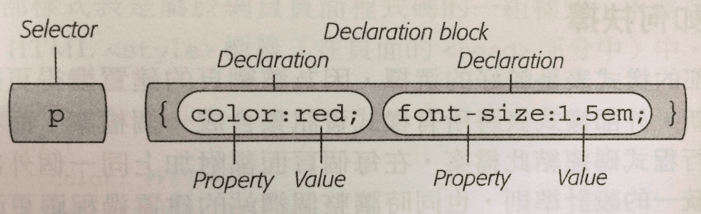

## Table of Contents

[Introduction](#introduction)

  1. [What is CSS](#what-is-css)

[Style Sheets](#style-sheets)

  1. [CSS Syntax](#css-syntax)
  2. [CSS Comments](#css-comments)
  3. [CSS Units](#css-units)
  4. [Three Ways to Insert CSS](#three-ways-to-insert-css)

[Selectors](#selectors)

[Style Inheritance](#style-inheritance)

[The Cascade](#the-cascade)

[Width and Height](#width-and-height)

  1. [Setting width And height](#setting-width-and-height)
  2. [Setting max-width](#setting-max-width)

[Display](#display)

[Box Model](#box-model)

[Layouts](#layouts)

  1. [Basic Typesetting Methods](#basic-typesetting-methods)
  2. [Float Layout](#float-layout)
  3. [Responsive Web Design](#responsive-web-design)
  4. [Flexbox](#flexbox)

[Form](#form)

  1. [Focused Inputs](#focused-inputs)
  2. [Input With Icon And Image](#input-with-icon-and-image)

[Transforms](#transforms)

[Transitions](#transitions)

  1. [Introduction transitions](#introduction-transitions)
  2. [How to use transitions](#how-to-use-transitions)
  3. [Change several property values](#change-several-property-values)
  4. [Specify the speed curve of the transition](#specify-the-speed-curve-of-the-transition)

[Animation](#animation)

  1. [What are CSS animations?](#what-are-css-animations)
  2. [The @keyframes rule](#the-@keyframes-rule)
  3. [Animation properties](#animation-properties)
  4. [Animation shorthand property](#animation-shorthand-property)

[Reference Information](#reference-information)

<br />

## Introduction

<a name="what-is-css"></a>
What is CSS?

  * **Cascading Style Sheets (CSS)**: A stylesheet language used to make HTML-based web pages visually appealing

  * CSS describes how HTML elements are to be displayed on screen, paper, or in other media

**[⬆ back to top](#table-of-contents)**

<br />
<br />

## Style Sheets

<a name="css-syntax"></a>
CSS Syntax

  * A style defines the appearance of an element on a page - it's a rule that tells the browser how to display something on the webpage

  * Styles consist of two main parts:

      - **Selector**: Points to the HTML element you want to style.

      - **Declaration Block**: Contains one or more declarations separated by semicolons.

        > Declaration blocks are surrounded by curly braces.

        - **Declaration**: Each declaration includes a CSS property name and a value, separated by a colon.

        - **Property**

        - **Value**

    

**[⬆ back to top](#table-of-contents)**

<br />
<br />

<a name="css-comments"></a>
CSS Comments

  * A CSS comment starts with `/*` and ends with `*/`. Comments can also span multiple lines.

    Example:

    ```css
    p {
      color: red;
      /* This is a single-line comment */
      text-align: center;
    }

    /* This is
    a multi-line
    comment */
    ```

**[⬆ back to top](#table-of-contents)**

<br />
<br />

<a name="css-units"></a>
CSS Units

  * CSS has several different units for expressing length.

  * Length is a number followed by a length unit, such as 10px, 2em, etc.

  * A whitespace cannot appear between the number and the unit. However, if the value is 0, the unit can be omitted.

  * There are two types of length units: relative and absolute.

  * Relative length units specify a length relative to another length property.

    - em: Relative to the `font-size` of the element (2em means 2 times the size of the current font).

    - rem: Relative to `font-size` of the root element.

    - %: Percentage

    > The size of an em or percent depends on its parent. If the text size of body is 16 pixels, then 150% or 1.5em will be 24 pixels (1.5 * 16).

  * Absolute length units are fixed and a length expressed in any of these will appear as exactly that size.

    - px: pixels (1px = 1/96th of 1in)

**[⬆ back to top](#table-of-contents)**

<br />
<br />

<a name="three-ways-to-insert-css"></a>
Three Ways to Insert CSS

  * There are three ways to load stylesheets on a page:

    - **Internal Style Sheet**: Part of the webpage code, exists within `<style>` tags in the `<head>` section.

      Example:

      ```html
      <html>
        <head>
          <style>
          h1 {
            color: #FF7643;
            font-family: Arial;
          }

          p {
            color: red;
            font-size: 1.5em;
          }
          </style>
        </head>

        <body>
          <!-- The rest of your page follows... -->
        </body>
      </html>
      ```

    - **External Style Sheet**: A separate .css file loaded via the `<link>` tag.

      Example:

      ```html
      <link rel="stylesheet" href="css/styles.css">
      ```

    - **Inline Style**: Styles written directly in the HTML tag's `style` attribute.

      Example:

      ```html
      <h1 style="color: #6A94CC;">
      ```

**[⬆ back to top](#table-of-contents)**

<br />
<br />

## Selectors

  * Selectors tell CSS which elements to target.

  * A CSS selector can contain more than one simple selector. Between the simple selectors, we can include a combinator.

  * Combinators: Explain the relationship between selectors.

  * There are four different combinators in CSS3:

    - Descendant selector `(space)` or `(>>)`

    - Child selector `(>)`

    - Adjacent sibling selector `(+)`

    - General sibling selector `(~)`

  * **Type or Element Selectors**: Select every tag of that type on the page.

    Example:

    ```css
    /* Select every <h2> tag on the page */
    h2 {
      color: #000000;
      margin-bottom: 0;
    }
    ```

  * **Class Selectors**: Select every tag with that class name in its class attribute.

    - Names must start with `.`

    - After `.` must be a character

    - Names can only use letters, numbers, hyphens, and underscores

    - Names are case-sensitive

    - A tag can have multiple classes

    Example:

    ```html
    <button class="btn add">Add</button>
    ```

    ```css
    /* Select every tag with .btn class in its class attribute */
    .btn {
      border-radius: 5px;
    }

    .add {
      background-color: green;
    }
    ```

    > You can also specify that only specific HTML elements should be affected by a class.

    Example:

    ```css
    /* Only <p> elements with class="center" will be center-aligned */
    p.center {
      text-align: center;
      color: red;
    }
    ```

  * **ID Selectors**: Uses the id attribute of an HTML element to select a specific element.

    - The id should be unique within a page.

    - To select an element with a specific id, write a hash (#) followed by the id.

    > An id name cannot start with a number!

    Example:

    ```html
    <div id="banner">
    ```

    ```css
    /* Select the element with this ID */
    #banner {
      background: #CC0000;
      height: 300px;
      width: 720px;
    }
    ```

  * **Grouping Selectors**: Select specified groups of tags to apply the same style.

    Example:

    ```css
    h1, h2, h3, h4, h5, h6 {
      color: #F1CD33;
    }

    /* Mixing different types of selectors */
    h1, p, .copyright, #banner {
      color: #F1CD33;
    }
    ```

  * **Universal Selector**: Selects all tags on the page.

    Example:

    ```css
    * {
      padding: 0;
      margin: 0;
    }

    /* Select all descendant tags after .banner */
    .banner * {
      float: left;
      color: #FFFFFF;
    }
    ```

  * **Descendant Selector**: Selects all specified descendant tags.

    Example:

    ```css
    /* Select <a> tags that are descendants of <li> */
    li a {
      font-family: Arial;
    }

    /* Select <a> tags that are descendants of .intro */
    .intro a {
      color: yellow;
    }
    ```

  * **Attribute Selector**: Selects tags with specific attributes.

    Example:

    ```css
    /* Select  tags with title attribute */
    img[title] {
      color: red;
    }

    /* Select <a> tags with exact href value */
    a[href="http://www.example.com"] {
      color: green;
      font-weight: bold;
    }

    /* Case-insensitive attribute selector */
    input[type="email" i] {
      border-color: blue;
    }
    ```

  * **Child Selector**: Selects direct child elements.

    Example:

    ```css
    /* Select <h1> tags that are direct children of <body> */
    body > h1 {
      color: #CCCCCC;
    }
    ```

  * **Adjacent Sibling Selector**: Selects the immediate sibling after an element.

    Example:

    ```css
    /* Select <p> that immediately follows <h2> */
    h2 + p {
      margin: 0 10px 10px 0;
    }
    ```

  * **General Sibling Selector**: Similar to adjacent sibling but selects all matching siblings after the element.

    Example:

    ```css
    /* Select all <p> tags that are siblings after <h2> */
    h2 ~ p {
      margin: 0 10px 10px 0;
    }
    ```

  * **Pseudo-Classes**: Define special states of elements.

    > `a:hover` MUST come after `a:link` and `a:visited` to be effective.

    Example:

    ```css
    /* Apply when user hovers over <a> */
    a:hover {
      color: yellow;
      font-weight: 400;
    }
    ```

  * **Pseudo-Elements**: Style specified parts of an element.

    > Use `::` for pseudo-elements, `:` for pseudo-classes.

    Example:

    ```css
    /* Style the first letter of <p> */
    p::first-letter {
      color: #ff0000;
      font-size: xx-large;
    }
    ```

**[⬆ back to top](#table-of-contents)**

<br />
<br />

## Style Inheritance

  * When properties pass from ancestor elements to descendants, it's called inheritance.

  * Not all CSS properties are inheritable.

  > Check [MDN Keyword Index](https://developer.mozilla.org/en-US/docs/Web/CSS/Reference#Keyword_index) for inheritable properties.

**[⬆ back to top](#table-of-contents)**

<br />
<br />

## The Cascade

  * The cascade manages how properties interact and resolve conflicts through priority rules.

  * Priority order (highest to lowest):

    - Inline style (inside HTML element)
    - External and internal style sheets
    - Browser default

  * **Inherited Styles**: Styles inherited from multiple ancestors combine to create new styles.

  * **Nearest Ancestor Wins**: When multiple ancestors define the same property.

  * **Direct Application Wins**: Properties applied directly to an element override inherited ones.

  * **Specificity Calculation**:

    - Tag selector: 1 point
    - Pseudo-element: 1 point
    - Class selector: 10 points
    - Attribute selector: 10 points
    - Pseudo-class: 10 points
    - ID selector: 100 points
    - Inline style: 1000 points

  * **!important Rule**: Forces a property to have highest priority.

    Example:

    ```css
    p .email {
      color: blue !important; /* This will override other rules */
    }
    ```

**[⬆ back to top](#table-of-contents)**

<br />
<br />

## Width and Height

<a name="setting-width-and-height"></a>
Setting width And height

  * The `height` and `width` properties set element dimensions.

  * Values can be:
    - auto (default, browser calculates)
    - length values (px, cm, etc.)
    - percentage of containing block

  * Example:

    ```css
    div {
      height: 200px;
      width: 50%;
    }
    ```

<a name="setting-max-width"></a>
Setting max-width

  * The `max-width` property sets maximum element width.

  * Overrides `width` if specified.

**[⬆ back to top](#table-of-contents)**

<br />
<br />

## Display

  * The `display` property specifies how an element is displayed.

  * Common values:
    - block: Starts on new line, takes full width
    - inline: Doesn't start new line, takes needed width
    - inline-block: Like inline but can have width/height
    - none: Hides element completely

  * Example:

    ```css
    .hidden {
      display: none;
    }
    ```

**[⬆ back to top](#table-of-contents)**

<br />
<br />

## Box Model

  * All HTML elements can be considered boxes with:
    - Margin (outside border, transparent)
    - Border (around padding/content)
    - Padding (around content, transparent)
    - Content (actual content area)

  * Shorthand notation:

    ```css
    /* Four values: top, right, bottom, left */
    .box {
      padding: 0 10px 10px 20px;
    }

    /* Two values: vertical, horizontal */
    .box {
      padding: 10px 20px;
    }
    ```

  * `box-sizing` property controls how dimensions are calculated:
    - content-box (default): width/height exclude padding/border
    - border-box: width/height include padding/border

  * `overflow` controls content that exceeds element dimensions:
    - visible (default)
    - scroll (always show scrollbars)
    - auto (scrollbars when needed)
    - hidden (hide overflow)

**[⬆ back to top](#table-of-contents)**

<br />
<br />

## Layouts

<a name="basic-typesetting-methods"></a>
Basic Typesetting Methods

  * `position` property values:
    - static (default)
    - relative (positioned relative to normal position)
    - absolute (positioned relative to nearest positioned ancestor)
    - fixed (positioned relative to viewport)
    - sticky (hybrid of relative and fixed)

<a name="float-layout"></a>
Float Layout

  * `float` makes elements float left/right with text wrapping around.

  * `clear` prevents elements from floating next to floated elements.

<a name="responsive-web-design"></a>
Responsive Web Design

  * Uses:
    - Flexible layouts
    - Flexible media
    - Media queries

  * Viewport meta tag:

    ```html
    <meta name="viewport" content="width=device-width, initial-scale=1.0">
    ```

  * Media query example:

    ```css
    @media (max-width: 600px) {
      .column {
        width: 100%;
      }
    }
    ```

<a name="flexbox"></a>
Flexbox

  * Flex container properties:
    - `flex-direction`: row/column
    - `flex-wrap`: wrap/nowrap
    - `justify-content`: horizontal alignment
    - `align-items`: vertical alignment

  * Flex item properties:
    - `order`: display order
    - `flex-grow`: ability to grow
    - `flex-shrink`: ability to shrink
    - `align-self`: individual alignment

**[⬆ back to top](#table-of-contents)**

<br />
<br />

## Form

<a name="focused-inputs"></a>
Focused Inputs

  * Remove default focus outline:

    ```css
    input:focus {
      outline: none;
    }
    ```

<a name="input-with-icon-and-image"></a>
Input With Icon And Image

  * Add icon inside input:

    ```css
    input[type=text] {
      background-image: url('icon.png');
      background-position: 10px 10px;
      padding-left: 40px;
    }
    ```

**[⬆ back to top](#table-of-contents)**

<br />
<br />

## Transforms

  * CSS transforms allow translating, rotating, scaling, and skewing elements.

  * Example:

    ```css
    .rotate {
      transform: rotate(30deg);
    }
    ```

**[⬆ back to top](#table-of-contents)**

<br />
<br />

## Transitions

<a name="introduction-transitions"></a>
Introduction transitions

  * CSS transitions enable smooth property changes over time.

<a name="how-to-use-transitions"></a>
How to use transitions?

  * Required:
    - CSS property to animate
    - Duration of effect

  * Example:

    ```css
    div {
      transition: width 2s;
    }
    ```

<a name="change-several-property-values"></a>
Change several property values

  * Example:

    ```css
    div {
      transition: width 2s, height 4s;
    }
    ```

<a name="specify-the-speed-curve-of-the-transition"></a>
Specify the speed curve of the transition

  * `transition-timing-function` values:
    - ease (default)
    - linear
    - ease-in
    - ease-out
    - ease-in-out
    - cubic-bezier()

**[⬆ back to top](#table-of-contents)**

<br />
<br />

## Animation

<a name="what-are-css-animations"></a>
What are CSS Animations?

  * Animate elements without JavaScript or Flash.

<a name="the-@keyframes-rule"></a>
The @keyframes Rule

  * Define animation sequence:

    ```css
    @keyframes example {
      0%   {background-color: red;}
      50%  {background-color: yellow;}
      100% {background-color: blue;}
    }
    ```

<a name="animation-properties"></a>
Animation Properties

  * Key properties:
    - animation-name
    - animation-duration
    - animation-timing-function
    - animation-delay
    - animation-iteration-count
    - animation-direction

<a name="animation-shorthand-property"></a>
Animation Shorthand Property

  * Example:

    ```css
    div {
      animation: example 5s linear 2s infinite alternate;
    }
    ```

**[⬆ back to top](#table-of-contents)**

<br />
<br />

## Reference Information

CSS: The Missing Manual, 4th Edition (Author: David Sawyer McFarland)

CSS Tutorial (Website: [w3schools](https://www.w3schools.com/css/default.asp))

Descendant Selectors (Website: [Mozilla Developer Network](https://developer.mozilla.org/en-US/docs/Web/CSS/Descendant_selectors))

Attribute Selectors (Website: [Mozilla Developer Network](https://developer.mozilla.org/en-US/docs/Web/CSS/Attribute_selectors))

HTML Elements: Block-Level vs. Inline Elements (Website: [ThoughtCo](https://www.thoughtco.com/block-level-vs-inline-elements-3468615))

Flexible box ("Flexbox") layout in Internet Explorer 10 (Website: [Microsoft Developer Network](https://msdn.microsoft.com/en-us/library/hh673531.aspx))
